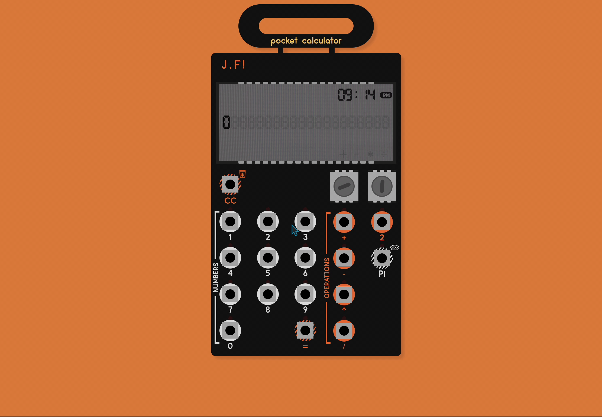
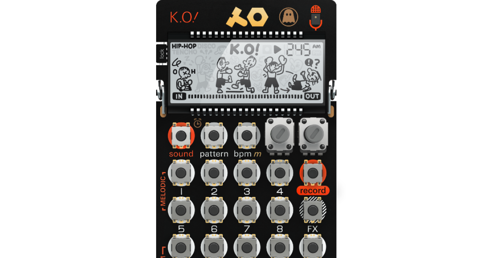
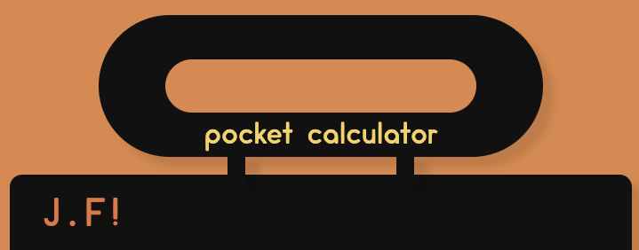
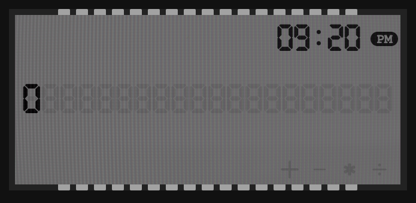
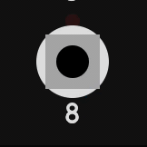
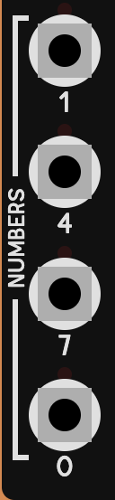
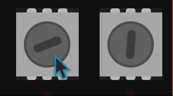

<!-- PROJECT LOGO -->
 

<h1 align="center">Pocket Calculator</h1>

  

    A React made calculator styed to emulat the look of a Pocket Operator a handheld music maker.
     
    <a href="https://linktowebsite.com">View Live Demo</a>

<!-- TABLE OF CONTENTS -->

  
Table of Contents

  <ol>
    <li>
      <a href="#about-the-project">About The Project</a>
      <ul>
        <li><a href="#built-with">Built With</a></li>
      </ul>
    </li>
    <li>
      <a href="#getting-started">React</a>
      <ul>
        <li><a href="#prerequisites">State</a></li>
        <li><a href="#installation">Math Equations</a></li>
      </ul>
    </li>
    <li><a href="#usage">Design</a></li>
    <ul>
        <li><a href="#prerequisites">Inspiration</a></li>
        <li><a href="#installation">Screen & Top</a></li>
        <li><a href="#installation">Buttons & Body</a></li>
    </ul>
    <li><a href="#contact">Usage</a></li>
    <li><a href="#contact">Contact</a></li>
    <li><a href="#acknowledgments">Acknowledgments</a></li>
  </ol>

<!-- ABOUT THE PROJECT -->
## About The Project

This is a react built calculator using state for updating, Run simple commands like a real non graphing calculator

### Built With
 - JavaScript, React
 - SCSS

## React

### State
I used 3 Main States in this project the first state is a string that is inputted by the user, i used a string because the ease of use for adding a number directly after.  
The Second would be the total which is a number and this is where all numbers are saved and where the equations get saved into, and then changed back into a string to display.  
The Third is a string that keeps track of which Sign user has clicked so when equal is pressed the math can be done properly.
After user has typed in their number i Parse it and which converts it to a number and waits to complete the Operation when the user to press Equals

### Math Equations
All equationa are solved using javascript by taking the parsed state string, and checking what user wants.
When the user presses a equation the First string gets parsed and sent into the total, waiting for the second string. After the second string is typed it Parses that number and adds it to the total state, which then converts the total state into a string for the User to view.

## Design

### Inspiration
this project was inspired by the look of Pocket Operators by Teenage Engineering, which look like this
 

 
I really like this look because it already almost looks like a calculator. And i tried to get as close as i could to re-creating the look and feel

### Screen & Top
For the top of the Pocket calculator it has a very distinct look that i had to nail on the browser, so i created a rectangle div and added a border radius, and then put a smaller rectangle inside that is the same color as the background, To create a hole. I then put the Logo on the top.

The screen was made by putting a screen texture over a div. the result on doing this i found is very good and adds alot to the project, For the background 8's i made these to try to recreate the look of a old calculator how u can see the 8's when they arent on. This was done by changing the opacity and putting it in the background behind the main state String.

The little knobs at the top and bottom of the screen was created using divs and was made to look like open circuitry like the Pocket Operator  

### Body

#### **Buttons**
The Buttons on a Pocket Operator have a very specifc look, So i again tried to recreate it as well as possible. The Dashed lines behind some of the buttons are created with a CSS gradient that goes for 1px at a degree to create a dash line inside of a circle div.

  

Red lights will flash when u click each button trying to emulate the Pocket Operator even more so. *(The icons around some of the buttons are svgs and positioned with css)*

#### **Cateogory Lines**
The Category Lines where made with 3 divs inside of one, with the lines going up and down only had a top border, and a right or left depending on what side. with text inbetween. i then rotated it 90 degrees and positioned it in the corresponding place

#### **Dials**
The spinning dials on the body are purely asthetic and are only there because it is a important part on a pocket operator. Each dial will revert to a random position when opening, setting a random degree everytime. When you click it it adds a CSS animation style to it and spins.

## Usage

To use the Pocket Calculator type in ur equations like you would on a real calculator and press equals to see the result.

<!-- CONTACT -->
## Contact

**John Farina** - johnfarina8@gmail.com

Project Link: [github.com/john-farina/react-calculator](https://github.com/john-farina/react-calculator)

(<a href="#readme-top">back to top</a>)

